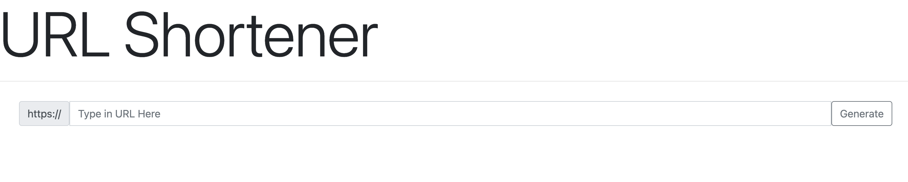

# URL Shortener

### Requirements 
    • Python
    • random, django

## Running the code
1. Ensure that random and django libraries are installed
2. At the file location, create the database by runining
    • Terminal commands: `python manage.py makemigrations shortener` and `python manage.py migrate`
3. Start the local server
    • Terminal commands: `python mamage.py runserver`

## Tutorial
1. Type in a URL
2. Click on generate or simply press Enter 
3. A shortened link will be generated after 
 Note: 'https://' is already provided! No need to include that in the input :) 

